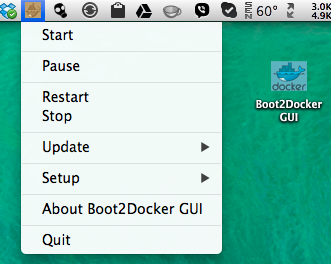

boot2docker GUI for Mac OS X
============================

boot2docker GUI for Mac OS X is a Mac Status bar App which allows to control the boot2docker shell script.
[boot2docker](https://github.com/steeve/boot2docker) is a lightweight Linux distribution made specifically to run [Docker](https://www.docker.io/) containers.



Download
--------
Head over to the [Releases Page](https://github.com/rimusz/boot2docker-gui-osx/releases) to grab the ZIP with the App.


How to use
----------

Simply unzip it whatever you like and just run it.
You will find a small icon with the docker image in the Status Bar.

* There you can install boot2docker OS and docker under Setup section
* Start, pause, restart, stop boot2docker OS VM
* Update boot2docker OS, boot2docker script and docker OS X client


How it works
------------

"Install boot2docker OS docker OS X client " under Setup menu option

It runs an external shell script which:
````
Creates ".boot2docker" config folder in user's home folder and puts the "profile" file there
with the pre-set of:
VM_DISK=~/.boot2docker/boot2docker.vmdk
BOOT2DOCKER_ISO=~/.boot2docker/boot2docker.iso
````

````
Creates and sets "bin" folder path and docker environment in .bash_profile
export PATH=$PATH:${HOME}/bin
export DOCKER_HOST=localhost
````

````
Downloads latest boot2docker OS script version
curl https://raw.github.com/steeve/boot2docker/master/boot2docker > ~/bin/boot2docker
# Makes it executable
chmod +x ~/bin/boot2docker

Run boot2docker init command
~/bin/boot2docker init
````

docker client part
````
Downloads latest docker OS X client
curl -o ~/bin/docker http://get.docker.io/builds/Darwin/x86_64/docker-latest
# Makes it executable
chmod +x ~/bin/docker
````
As you can see boot2docker OS files get placed under /.boot2docker folder in the user's
home folder. It keeps the setup tidy.

boot2docker script  and docker client files get placed in /bin folder in the user's
home folder as well.

".bash_profile" gets updated with path to the /bin folder and where the DOCKER_HOST points to.

The rest of menu options Start, Pause and etc just call an external shell script with such command to start 
the boot2docker OS:
````
  ~/bin/boot2docker start
````
And so one for the rest of menu options.


Update part (runs an external Apps which are packaged scheel scripts with [Platypus](http://sveinbjorn.org/platypus)

docker client update
````
curl -o ~/bin/docker http://get.docker.io/builds/Darwin/x86_64/docker-latest
````

boot2docker script update
````
curl https://raw.github.com/steeve/boot2docker/master/boot2docker > ~/bin/boot2docker
````

boot2docker ISO update
````
~/bin/boot2docker download
````

* So nothing to special there, just all commands reused which are provided by awesome "docker.io" and "boot2docker" guys


TO-DOs
------

* Update readme.md with more detailed information
* Open at login
* Better external shell scripts integration to the App instead of using Platypus based shell scripts as Apps.
